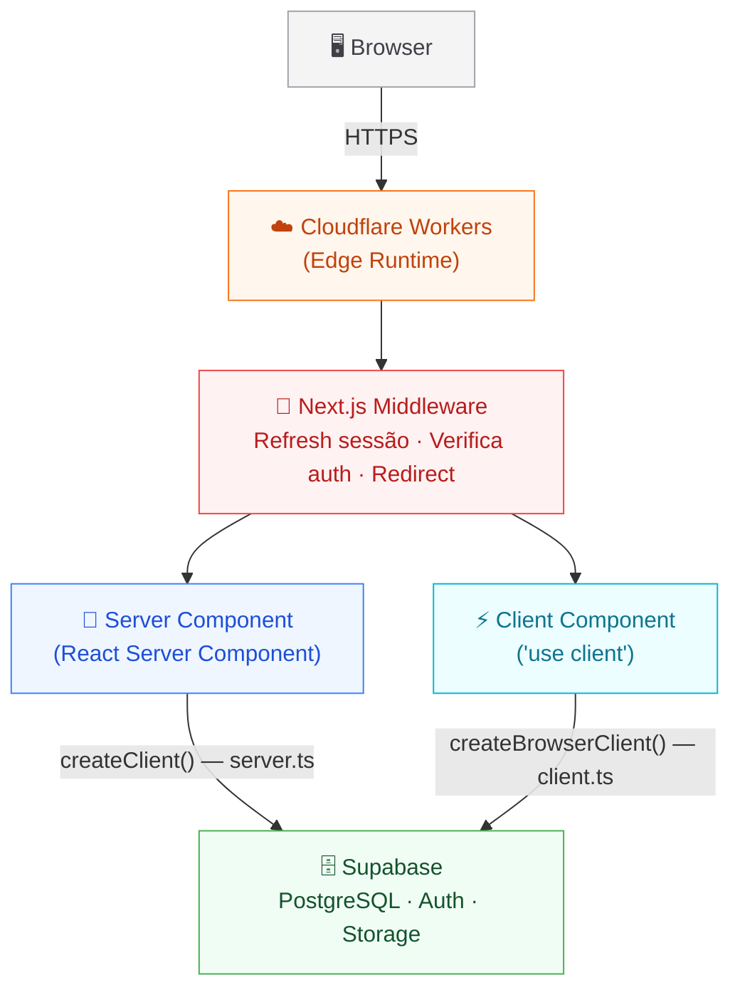
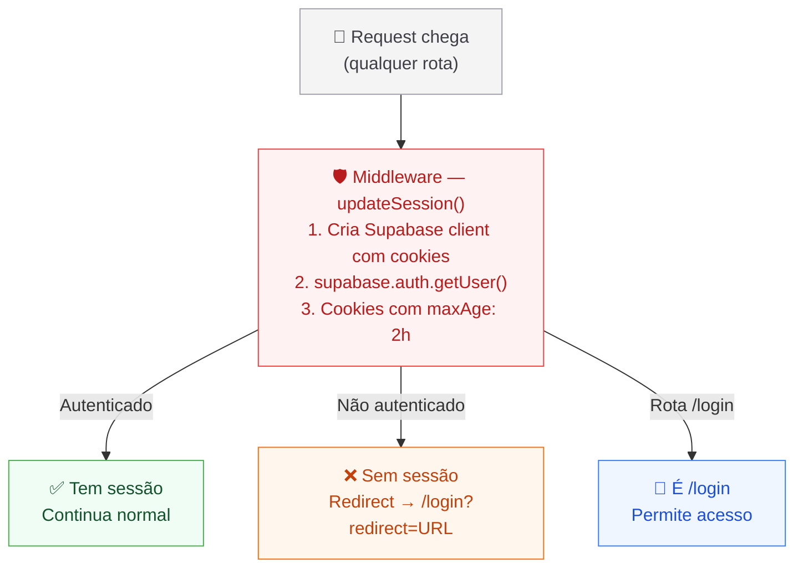
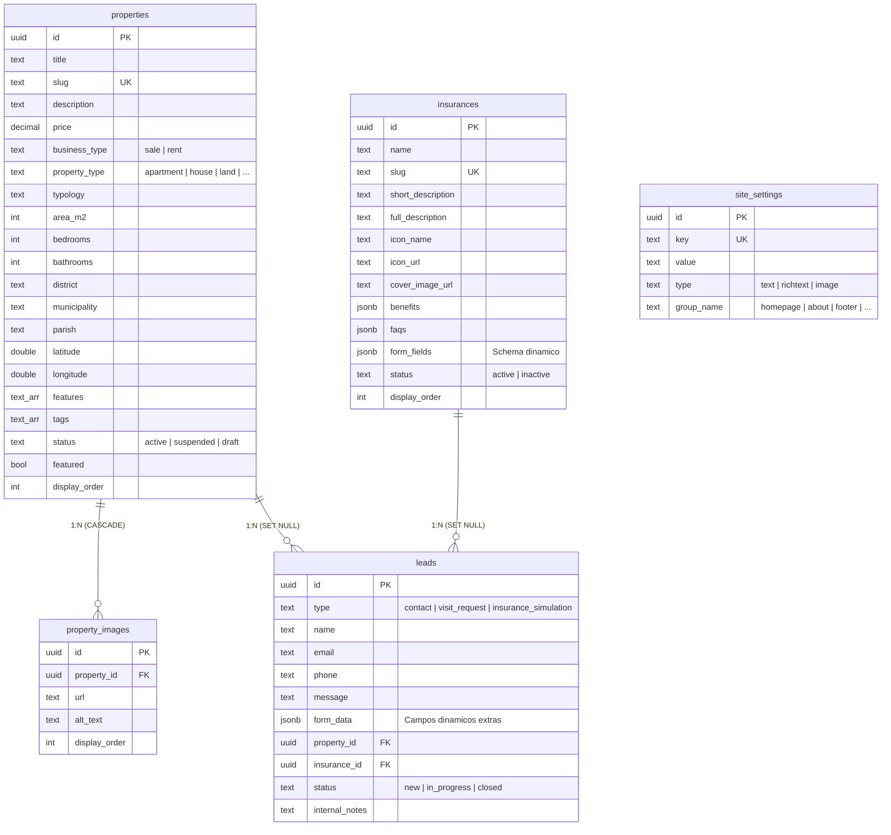
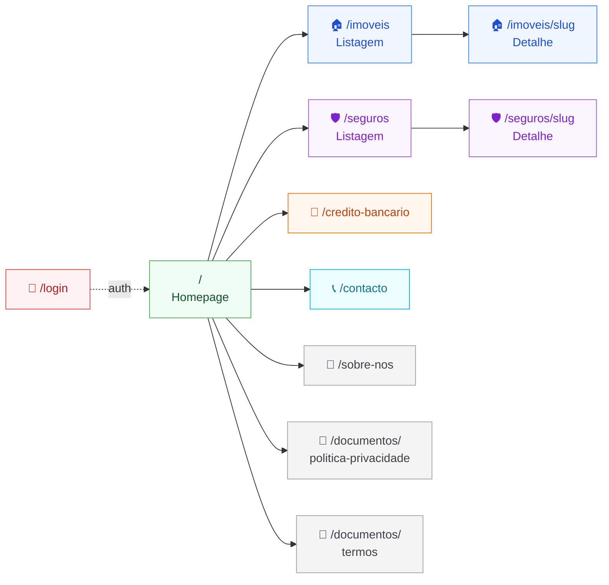
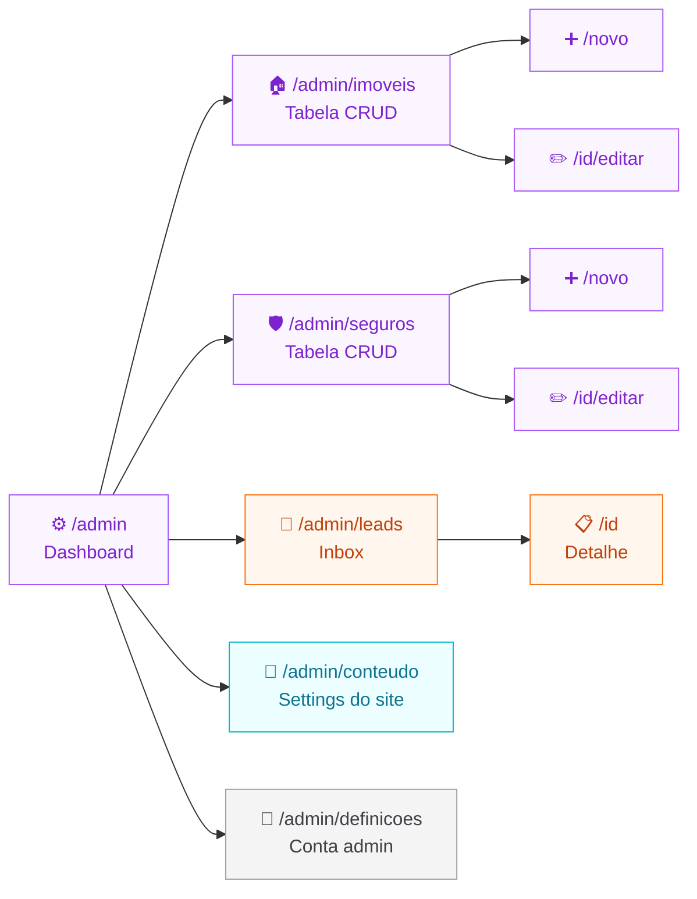
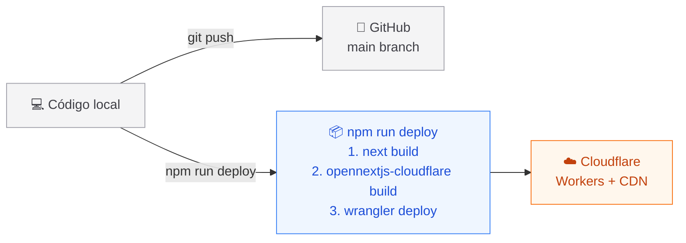

<div align="center">

# 🏠 Rui Figueira & Roque

**Mediação Imobiliária · Seguros · Crédito Bancário**

Plataforma completa com site público e backoffice de gestão, construída com as mais modernas tecnologias web.

[](https://nextjs.org/)
[](https://react.dev/)
[](https://typescriptlang.org/)
[](https://supabase.com/)
[](https://workers.cloudflare.com/)
[](https://tailwindcss.com/)

</div>

---

## 📋 Índice

- [Arquitetura do Sistema](#-arquitetura-do-sistema)
- [Stack Tecnológica](#-stack-tecnológica)
- [Fluxo de Autenticação](#-fluxo-de-autenticação)
- [Base de Dados](#-base-de-dados)
- [Mapa de Rotas](#️-mapa-de-rotas)
- [Funcionalidades](#-funcionalidades)
- [Dark Mode](#-dark-mode)
- [Deploy](#-deploy)
- [Configuração Local](#-configuração-local)

---

## 🏗 Arquitetura do Sistema

> Visão geral do fluxo de um request, desde o browser até à base de dados.



---

## ⚡ Stack Tecnológica

| Categoria | Tecnologias |
|-----------|------------|
| **Framework** | Next.js 16.1.6 (App Router) · React 19 · TypeScript 5 |
| **Styling** | Tailwind CSS 4 · Radix UI (shadcn/ui) · Lucide Icons |
| **Base de Dados** | Supabase (PostgreSQL) |
| **Autenticação** | Supabase Auth (email/password + cookies) |
| **Storage** | Supabase Storage (2 buckets públicos) |
| **Formulários** | React Hook Form + Zod |
| **Editor Rich Text** | TipTap |
| **Mapas** | Leaflet + OpenStreetMap |
| **Drag & Drop** | dnd-kit |
| **Temas** | next-themes (light/dark) |
| **Hosting** | Cloudflare Workers via @opennextjs/cloudflare |
| **Fonts** | Inter (corpo) + Outfit (headings) via next/font |

---

## 🔐 Fluxo de Autenticação

> ⚠️ **Toda a aplicação está protegida.** Sem login não se acede a nenhuma página.



### Pós-Login

Após login com sucesso, o utilizador vê dois botões:

| Botão | Ação | Detalhe |
|-------|------|---------|
| 🌐 **Entrar no Site** | `window.open("/", "_blank")` | Abre em nova tab |
| ⚙️ **Entrar no Backoffice** | `window.location.href = "/admin"` | Hard navigation (300ms delay no mobile) |

---

## 🗄 Base de Dados

> PostgreSQL via Supabase — 5 tabelas principais



### Storage (Supabase Buckets)

| Bucket | Conteúdo | Acesso |
|--------|----------|--------|
| 📷 `property-photos` | Fotos dos imóveis | SELECT público · CUD com auth |
| 🎨 `site-assets` | Hero banner, foto About, assets | SELECT público · CUD com auth |

---

## 🗺️ Mapa de Rotas

### Páginas Públicas



### Admin (Backoffice)



---

## 🌟 Funcionalidades

### Site Público

| Funcionalidade | Descrição |
|----------------|-----------|
| **Homepage com Banner** | Hero com imagem de fundo configurável pelo admin, overlay escuro, texto com drop-shadow |
| **Portefólio de Imóveis** | Listagem com filtros (tipo, negócio, localização), galeria lightbox, mapa de localização |
| **Seguros** | Listagem de apólices, detalhe com benefícios, FAQs e formulário de simulação dinâmico |
| **Crédito Bancário** | Página informativa com parceiros de crédito habitação |
| **Captura de Leads** | Formulários inteligentes em contacto, visita a imóveis e simulação de seguros |
| **Mapa com Privacidade** | Localização aproximada (sem expor morada exata) via Leaflet/OpenStreetMap |

### Backoffice (Admin)

| Funcionalidade | Descrição |
|----------------|-----------|
| **CRUD Imóveis** | Criar, editar, eliminar propriedades com galeria drag-and-drop |
| **CRUD Seguros** | Gestão de apólices com editor Rich Text (TipTap) e formulários dinâmicos via JSONB |
| **Inbox de Leads** | CRM básico com filtros, métricas, notas internas e gestão de status |
| **Gestão de Conteúdos** | Alterar textos, imagens e configurações de todas as páginas do site |
| **Definições** | Alteração de email e password do admin |
| **Geocodificação** | Map picker para seleccionar coordenadas dos imóveis |

### Fluxo de Lead (end-to-end)

```mermaid
flowchart LR
    USER["👤 Utilizador\npreenche formulário"]
    FORM["📝 LeadForm\n(Client Component)"]
    ACTION["⚡ submitLead()\n(Server Action)"]
    DB["🗄️ Supabase\ntabela leads"]
    ADMIN["👨‍💼 Admin\n/admin/leads"]

    USER -->|"submit"| FORM
    FORM -->|"Server Action"| ACTION
    ACTION -->|"INSERT + revalidatePath"| DB
    DB -->|"visível"| ADMIN

    style USER fill:#f4f4f5,stroke:#a1a1aa,color:#3f3f46
    style FORM fill:#ecfeff,stroke:#06b6d4,color:#0e7490
    style ACTION fill:#eff6ff,stroke:#3b82f6,color:#1d4ed8
    style DB fill:#f0fdf4,stroke:#4CAF50,color:#14532d
    style ADMIN fill:#faf5ff,stroke:#a855f7,color:#7e22ce
```



---

## 🌙 Dark Mode

Sistema completo de dark mode com `next-themes`:

| Configuração | Valor |
|-------------|-------|
| **Provider** | `next-themes` com `attribute="class"` |
| **Default** | `system` (respeita preferência do OS) |
| **Toggle** | Botão flutuante global (bottom-right, visível em todas as páginas) |
| **Tailwind** | `@custom-variant dark (&:where(.dark, .dark *));` |

**Cores da marca (fixas em ambos os temas):**

| Cor | Hex | Uso |
|-----|-----|-----|
| 🟢 Primary | `#4CAF50` | Botões, links, destaques |
| 🟢 Dark | `#2E7D32` | Hover states, gradientes |
| 🟢 Light | `#81C784` | Backgrounds subtis |
| 🟢 Accent | `#66BB6A` | Elementos secundários |

---

## 🚀 Deploy



> ⚠️ **Deploy é manual** — executa-se `npm run deploy` localmente. Não há CI/CD configurado.

---

## 🛠 Configuração Local

### Pré-requisitos

- Node.js 18+
- Conta Supabase com projeto configurado

### Instalação

```bash
# 1. Clonar repositório
git clone https://github.com/Rafa200200/rui-figueira-roque.git
cd rui-figueira-roque

# 2. Instalar dependências
npm install

# 3. Configurar variáveis de ambiente
cp .env.example .env.local
```

### Variáveis de Ambiente

Criar ficheiro `.env.local` na raiz:

```env
NEXT_PUBLIC_SUPABASE_URL=https://xxxxx.supabase.co
NEXT_PUBLIC_SUPABASE_ANON_KEY=eyJhbGciOiJ...
```

| Variável | Descrição | Onde obter |
|----------|-----------|------------|
| `NEXT_PUBLIC_SUPABASE_URL` | URL do projeto Supabase | Supabase Dashboard → Settings → API |
| `NEXT_PUBLIC_SUPABASE_ANON_KEY` | Chave anon pública | Supabase Dashboard → Settings → API |

### Comandos

```bash
npm run dev       # Servidor de desenvolvimento (Turbopack)
npm run build     # Build de produção
npm run deploy    # Build + deploy para Cloudflare Workers
```

### Base de Dados

Executar os ficheiros SQL no Supabase SQL Editor por esta ordem:

1. `supabase/schema.sql` — Criação de tabelas
2. `supabase/storage.sql` — Configuração de buckets
3. `supabase/seed.sql` — Dados iniciais (settings do site)
4. `supabase/migrations/20260310_add_coordinates.sql` — Coordenadas GPS

---

## ⚠️ Notas Importantes

> [!WARNING]
> **Site protegido por login** — todas as páginas (incluindo públicas) requerem autenticação. Isto é intencional para a fase de testes.

> [!WARNING]
> **RLS desligado** — Row Level Security está comentado. A segurança depende do middleware auth gate.

> [!NOTE]
> **Sessões de 2h** — cookies expiram em 7200s. Fix para Safari iOS.

> [!NOTE]
> **revalidate = 0** — sem cache em nenhuma página. SSR puro em cada request.

> [!NOTE]
> **Sem signup** — admins criados manualmente no painel Supabase (Authentication → Users).

---

<div align="center">

**Rui Figueira & Roque Lda** · Mediação Imobiliária AMI · Mediação de Seguros ASF

*Desenvolvido com ❤️ usando Next.js, Supabase e Cloudflare Workers*

</div>


